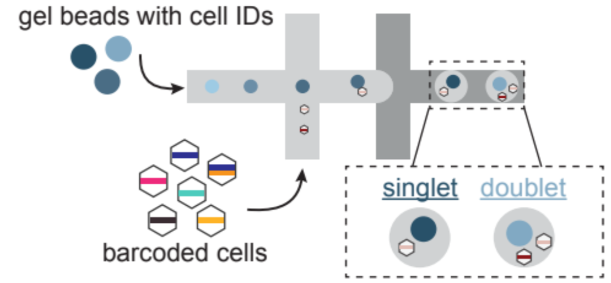

========================
Doublets in Sequencing
========================

.. contents::
   :local:
   :depth: 2

How doublets form?
====================

Single-cell RNA sequencing (scRNA-seq) datasets comprise true single cells, or singlets, in addition to cells that coalesce during the protocol, or doublets. 

SCHEMATIC: 1A

scRNA-seq technologies rely on distributing individual cells from a suspension into individual reactions, each labeled with a unique “ID”, usually in the form of a reaction-specific sequence barcode. Despite numerous technological optimizations, multiple cells can occasionally be encapsulated in a single reaction, resulting in doublets or multiplets where two or more cells are assigned the same reaction ID. In some cases, beyond the random chance of two cells encapsulated in a single reaction, cellular physiology and the nature of experimental assays can promote cells to clump, leading to an enhanced doublet fraction.[REF 1, 2] The percentage of doublets in a given experiment depends on several factors, including the features of the sample and throughput, and can be as high as 40-50% [REF 3,4]

Doublet diversity
---------------------------------
Doublets can form from cells belonging to vastly different cell types or species - these are called heterotypic doublets. On the other hand, homotypic doublets can also form from transcriptionally similar cells. 

Downstream impact of doublets
===============================
The presence of doublets can impact downstream functional analysis used to interpret the scRNA-seq datasets. Using the datasets we simulated with varying doublet percentages (:doc: `read more about doublet simulation and the dataset here<>`), we assessed the impact on commonly implemented downstream analysis.

SCHEMATIC: 5

.. line-block::
    **Clustering stability**
    Clustering is one of the most common analysis done to infer the identity of similar cells. When the number of doublets were increased, the probability of the correct number of cell clusters decreased. This might lead to spurious clusters or a genuine sub-type of cells not being identified as a distinct group. 

    **Differential expression**
    Differential expression is used to identify the genes that are differentially expression between cells belonging to different conditions. The genes identified could be used to explain the phenotype observed or examine pathways involved. 
    Increasing doublet rate decreases the precision, recall, and true negative rate (TNR) for the datasets when compared to the differentially expressed genes inferred from the clean singlets-only dataset, with a higher doublet rate leading to worse performance. 

    **Cell-cell communication inference**
    Cell-cell communication inference can provide information about intercellular communication networks present in the sample sequenced. This can be used to understand the role of cell-cell interactions in biological processes. [REF CellChat]. Increasing the doublet rate decreases the precision and recall for communication pathways identified when compared to the clean singlets only datasets. 

    **Cell Trajectory**
    Increasing doublet rate caused the trajectory to deviate away from the trajectory inferred from the clean singlet-only datasets and there were gain/loss of lineages when doublets were introduced. 

