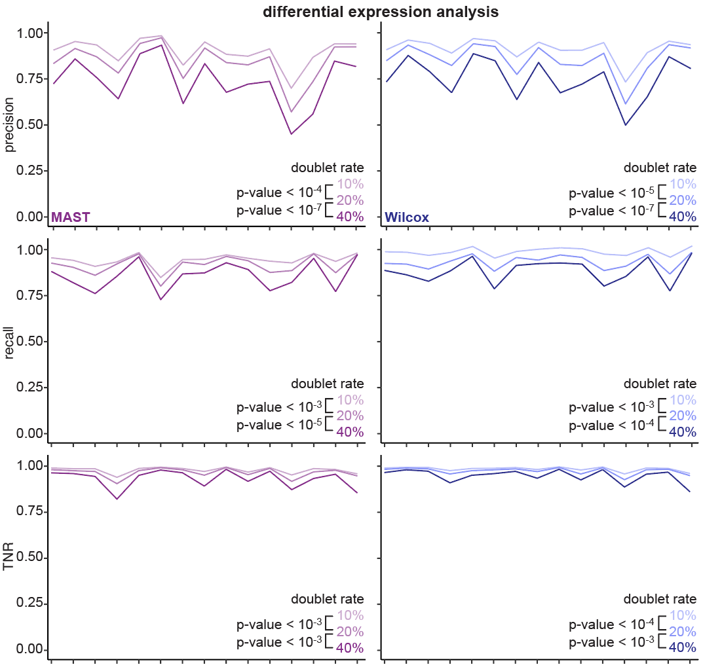

========================
doublets in sequencing
========================

.. contents::
   :local:
   :depth: 2

How do doublets form?
========================

Single-cell RNA sequencing (scRNA-seq) datasets contain true single cells, or singlets, in addition to cells that randomly coalesce during the protocol, or doublets. Sometimes, there are higher rates of doublets which can be attributed to cellular physiology and experimental protocols can lead to cell clumping. Doublet percentage in a sample be as high as 40%. Doublets can be two very transcriptionally different cells captured together (heterotypic) or two transcriptionally similar cells captured together (homotypic). Doublets are difficult to identify because just because two cells are captured together does not mean there is simply more absolute RNA fragments present or sequenced in doublet cases, and cells exist on a transcriptional continuum, making identification of valid singlet cells difficult, especially if cells are in a transitioning or reprogrammed state.

.. figure:: images/Figure1A.png
   :scale: 50 %
   :alt: How doublets are generated during sequencing
   
   
   *Schematic of how cells with lineage barcodes appear in the single-cell sequencer where droplets add a unique cell ID. The singlet depicted is one reaction droplet with a single cell such that there is a 1:1:1 mapping of a cell to a barcode to a cell ID. Alternatively, an example of a doublet is when one droplet has two or more cells, each having a unique barcode.*

Downstream impact of doublets
===============================

Doublets are problematic because they can impact the conclusions of scRNA-seq downstream functional analyses. We found that doublets confound downstream analyses when we tested common downstream scRNA-seq data analysis protocols (differential expression, cell trajectory, clustering stability, and cell-cell communication) on datasets of various doublet percentages. A schematic for how these datasets were generated and examples of our results for differential expression are below.

.. figure:: /images/Figure5A.png
   :scale: 50 %
   :align: center
   :alt: Schematic of datasets generated for all functional analyses. The dataset is first processed to have 40% doublets and undergo standard Seurat processing with Leiden clustering, where cluster labels here are represented in different colors in UMAP space (second box, left), and doublet labels are represented by different shades of blue in UMAP space (second box, right). Then,doublets are removed to achieve 20%, 10% and 0% doublet datasets. The 0%, 10%, 20% and 40% doublet rate datasets are generated for each dataset used in benchmarking except for Smart-seq3 to evaluate doublet impact on various downstream analyses: cell trajectory, cell-cell communication, clustering stability, and differential expression.

   *Schematic of datasets generated for all functional analyses. The dataset is first processed to have 40% doublets and undergo standard Seurat processing with Leiden clustering, where cluster labels here are represented in different colors in UMAP space (second box, left), and doublet labels are represented by different shades of blue in UMAP space (second box, right). Then,doublets are removed to achieve 20%, 10% and 0% doublet datasets. The 0%, 10%, 20% and 40% doublet rate datasets are generated for each dataset used in benchmarking except for Smart-seq3 to evaluate doublet impact on various downstream analyses: cell trajectory, cell-cell communication, clustering stability, and differential expression.*

.. line-block::

   **differential expression**
   Differential expression is used to identify the genes that are differentially expressed between cells belonging to different conditions. The genes identified could be used to explain the phenotype observed or examine pathways involved. Our results indicated that increasing doublet rate decreases the precision, recall, and true negative rate (TNR) for the datasets when compared to the differentially expressed genes inferred from the clean singlets-only dataset, with a higher doublet rate leading to worse performance.

ion, recall and TNR are calculated against ground truth differentially expressed genes in the corresponding dataset without doublets. P-values between variable doublet rate datasets are calculated with a paired Wilcoxon signed-rank test.

   *Differential expression analysis results for all datasets using MAST (purple, left) and Wilcox (blue, right) on two randomly chosen clusters at various doublet rates. Line color shade represents the % doublet rate, with a more saturated color indicative of a higher doublet rate. Precision, recall and TNR are calculated against ground truth differentially expressed genes in the corresponding dataset without doublets. P-values between variable doublet rate datasets are calculated with a paired Wilcoxon signed-rank test.*

.. line-block::
   **clustering stability**
   Clustering is one of the most common analyses done to infer the identity of similar cells. When the number of doublets were increased, the probability of getting the correct number of cell clusters decreased. This might lead to spurious clusters or a genuine sub-type of cells not being identified as a distinct group. For details about our results, see our paper.

   **cell-cell communication**
   Cell-cell communication inference can provide information about intercellular communication networks. This can be used to understand the role of cell-cell interactions in biological processes. Increasing the doublet rate decreases the precision and recall for communication pathways identified when compared to the clean singlets only datasets. For details about our results, see our paper.

   **cell trajectory**
   Increasing doublet rate caused the trajectory to deviate away from the trajectory inferred from the clean singlet-only datasets and there were gain/loss of lineages when doublets were introduced. For details about our results, see our paper.

