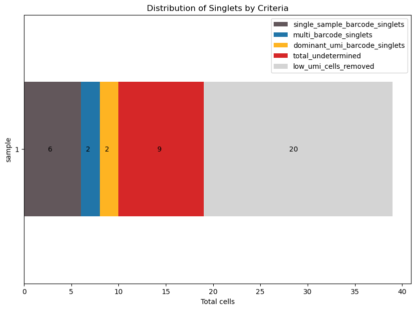

=======================================
Vignette to use singletCode package
=======================================
The input needed to run singletCode is a .csv file that contains the
information about cell ID (added while sequencing), lineage barcode, and
sample name. Each row should be repeated n times where n is the number
of UMIs associated with that barcode and cell ID combination. You can
download a sample input sheet
`here <https://github.com/GoyalLab/SingletCodeWebsite/raw/main/source/dataVignette/singletCodePackageVignetteData.zip>`__.
It is a subset of data from Jiang Et al and details about it are
described in the singletCode paper in detail. The folder also contains
expected output files in the test folder within the outputFiles folder.
This vignette can be downloaded as a jupyter notebook from the
`singletCode Tools
repo <https://github.com/GoyalLab/singletCodeTools/tree/main/vignette>`__.

Install singletCode package
---------------------------

.. code:: ipython3

    !pip3 install singletCode

Import necessary functions from it

.. code:: ipython3

    from singletCode import check_sample_sheet, get_singlets

Read in input sheet
-------------------

.. code:: ipython3

    # Read in input sheet
    import pandas as pd
    path = "path/to/downloaded/and/unzipped/folder"
    pathToInputSheet = f"{path}/inputFiles/JiangEtAlSubset_InputSheet.csv"
    df = pd.read_csv(pathToInputSheet)

Check formatting of input sheet
-------------------------------

.. code:: ipython3

    check_sample_sheet(df)

.. parsed-literal::

    The sample sheet provided can be used as input to get_singlets to get a list of singlets identified.

The sample sheet provided can be used as input to get_singlets to get a
list of singlets identified.

Identify singlets from input sheet
----------------------------------

.. code:: ipython3

    outputPath = "path/to/output/folder"
    cellLabelList, stats = get_singlets(df, dataset_name= "JiangEtAlSubset", save_all_singlet_categories = True, output_path=outputPath)

.. parsed-literal::

    INFO: Raw data counts: 
    sample
    1    1306
    Name: count, dtype: int64
    Total cells for sample 1: 39
    INFO: Using ratio based filtering.
    Current Sample Adjusted UMI cutoff: 2

.. parsed-literal::

    100%|██████████| 122/122 [00:00<00:00, 11475.27it/s]

.. parsed-literal::

    All singlets identified with multiple barcodes are unique? True
    Total Singlets: 10
    Total Multiplets: 9

.. parsed-literal::

    

.. code:: ipython3

    stats.to_csv(f"{outputPath}/JiangEtAlSubset_stats.csv")
    cellLabelList[cellLabelList['label'] == "Singlet"].to_csv(f"{outputPath}/JiangEtAlSubset_singletList.csv")

Visualizing the distribution of cells into low UMI, different kinds of
singlets and undetermined

.. code:: ipython3

    import matplotlib.pyplot as plt
    #Plotting the distribution of low UMI cells, different kinds of singlets, and undetermined cells.
    colors = ['#62575b', '#2175a8', '#feb422', '#d62728', '#d4d4d4']  # Example colors, modify as needed
    plotData = stats.set_index('sample', inplace=False).drop(columns = ['dataset', 'total_cells', "total_singlets"])
    
    # Plotting
    ax = plotData.plot(kind='barh', stacked=True, figsize=(10, 7), color=colors)
    
    for p in ax.patches:
        ax.annotate(f'{int(p.get_width())}', (p.get_x() + p.get_width()/2, p.get_y() + p.get_height()/2), ha='right', va='center')
    
    ax.set_xlabel('Total cells')
    ax.set_title('Distribution of Singlets by Criteria')
    plt.show()

The above plot shows that the data we had contained different kind of
singlets: 6 single-barcode cells, 2 cells which had more than one
barcode but with same combination being present in more than one cell, 2
cells that had one dominant barcode. The data also contained 9 cells
which singletCode could not determine as being truly singlets and 20
cells whose barcode UMI counts were below the set threshold.

Understanding the output files
------------------------------

To understand some of the files in the output, we can look at cell IDs
and their data in the original input sheet

For the dominant_umi_singlets, there are two cell IDs. One of them is
TGTAAGCGTCTCGCGA. If we look at that entry in the input sheet and count
the number of UMI associated with each barcode, we see that one barcode
has 99 UMI counts while the second highest UMI count is 7. So, the cell
most likely has only one barcode associated with it and hence, a
singlet.

.. code:: ipython3

    import pandas as pd
    df[df['cellID'] == 'TGTAAGCGTCTCGCGA'].groupby(['cellID', 'barcode', 'sample']).size().reset_index(name='count').sort_values('count', ascending=False).reset_index(drop=True)

.. raw:: html

    

    
    <table border="1" class="dataframe">
      <thead>
        <tr style="text-align: right;">
          <th></th>
          <th>cellID</th>
          <th>barcode</th>
          <th>sample</th>
          <th>count</th>
        </tr>
      </thead>
      <tbody>
        <tr>
          <th>0</th>
          <td>TGTAAGCGTCTCGCGA</td>
          <td>ATTGTTGTTGCAGATGCAGTTGATGCTGATGAAGTTGTACAAGGTC...</td>
          <td>1</td>
          <td>99</td>
        </tr>
        <tr>
          <th>1</th>
          <td>TGTAAGCGTCTCGCGA</td>
          <td>ATTCGACTTGATCTTCTAGAACATGGTGAACTAGCAGGTGCTGATC...</td>
          <td>1</td>
          <td>7</td>
        </tr>
        <tr>
          <th>2</th>
          <td>TGTAAGCGTCTCGCGA</td>
          <td>ATACTAGCTCAAGCAGTACTACTACTTCGTCTTCATGCAGAACAAC...</td>
          <td>1</td>
          <td>6</td>
        </tr>
        <tr>
          <th>3</th>
          <td>TGTAAGCGTCTCGCGA</td>
          <td>ATAGATGCACTTGGTGGTCGAGTTCTAGTTGTAGCTGATCGTCCAG...</td>
          <td>1</td>
          <td>6</td>
        </tr>
        <tr>
          <th>4</th>
          <td>TGTAAGCGTCTCGCGA</td>
          <td>ATTCGACCAGAACCACATGCAGTTCAACGTGTTCGAGGTGTAGATG...</td>
          <td>1</td>
          <td>6</td>
        </tr>
        <tr>
          <th>...</th>
          <td>...</td>
          <td>...</td>
          <td>...</td>
          <td>...</td>
        </tr>
        <tr>
          <th>82</th>
          <td>TGTAAGCGTCTCGCGA</td>
          <td>ATAGTAGTAGCTGTTGGTGTTGAAGTACTTCCTCTTGCTCCTCGTG...</td>
          <td>1</td>
          <td>1</td>
        </tr>
        <tr>
          <th>83</th>
          <td>TGTAAGCGTCTCGCGA</td>
          <td>ATAGTAGATGAACGTCCTCTACATGTTCTTCGTCAAGTACCAGCAC...</td>
          <td>1</td>
          <td>1</td>
        </tr>
        <tr>
          <th>84</th>
          <td>TGTAAGCGTCTCGCGA</td>
          <td>ATAGTACATGGTGGACCTGGACTTCGAGATGGAGCTCTTGTTCCTG...</td>
          <td>1</td>
          <td>1</td>
        </tr>
        <tr>
          <th>85</th>
          <td>TGTAAGCGTCTCGCGA</td>
          <td>ATAGGAGTAGTTGGTGATGGTCTACCAGAAGGTGAAGGTGGAGAAG...</td>
          <td>1</td>
          <td>1</td>
        </tr>
        <tr>
          <th>86</th>
          <td>TGTAAGCGTCTCGCGA</td>
          <td>GGTGCTCAACTTCTTGTTGTACTTCTAGTTGATGTTGGACGTCATC...</td>
          <td>1</td>
          <td>1</td>
        </tr>
      </tbody>
    </table>
    
87 rows × 4 columns

    

Next, we can look at multi-barcode singlets. There are two cell IDs:
AGGCTGCTCTTTCCGG and GAGGGATGTAACATCC. If we look at the barcodes with
greater than 2 UMI counts, we see that they have the same combination.
The only way this can occur is if a cell receives multiple barcode
initially and then divides.

.. code:: ipython3

    (df[df['cellID'] == 'AGGCTGCTCTTTCCGG']
     .groupby(['cellID', 'barcode', 'sample'])
     .size()
     .reset_index(name='count')
     .sort_values('count', ascending=False)
     .query('count >= 2')
     .reset_index(drop=True)
    )

.. raw:: html

    

    
    <table border="1" class="dataframe">
      <thead>
        <tr style="text-align: right;">
          <th></th>
          <th>cellID</th>
          <th>barcode</th>
          <th>sample</th>
          <th>count</th>
        </tr>
      </thead>
      <tbody>
        <tr>
          <th>0</th>
          <td>AGGCTGCTCTTTCCGG</td>
          <td>ATAGGAGTAGTTGGTGATGGTCTACCAGAAGGTGAAGGTGGAGAAG...</td>
          <td>1</td>
          <td>13</td>
        </tr>
        <tr>
          <th>1</th>
          <td>AGGCTGCTCTTTCCGG</td>
          <td>ATTGAACGTGGAGTTGAACTTGTACTACGAGTACGTCTAGAACATG...</td>
          <td>1</td>
          <td>2</td>
        </tr>
      </tbody>
    </table>
    

scRNAseq data
-------------

Further single-cell RNAseq analysis with both scRNAseq data and singlet
information from singletCode output

Install and import scanpy for further single-cell RNAseq analysis

.. code:: ipython3

    !pip scanpy[leiden]

.. code:: ipython3

    #Import scanpy
    import scanpy as sc

Reading the scRNAseq input data in h5ad format

.. code:: ipython3

    #Reading the scRNAseq data in h5ad format
    adata = sc.read_h5ad(f"{path}/inputFiles/JiangEtAlSubset_scRNAseqData.h5ad")
    adata

.. parsed-literal::

    AnnData object with n_obs × n_vars = 39 × 36601
        var: 'gene_ids', 'feature_types'

| Making copies of singletCode input/output to use them along with
  scRNAseq data. The -1 is added to cell IDs to match the cell IDs seen
  in 10x format data.
| **NOTE**: It may not be needed for your actual data.

.. code:: ipython3

    singleCellDf = df.copy()
    singleCellDf['cellID'] = singleCellDf['cellID'] + "-1"
    singleCellDf = singleCellDf.drop_duplicates(subset = 'cellID')
    cellLabelListSingleCell = cellLabelList.copy()
    cellLabelListSingleCell['cellID'] = cellLabelListSingleCell['cellID'] + "-1"
    cellLabelListSingleCell = cellLabelListSingleCell.drop_duplicates(subset='cellID').reset_index(drop = True)

Calculating total counts and genes identified per cell.
~~~~~~~~~~~~~~~~~~~~~~~~~~~~~~~~~~~~~~~~~~~~~~~~~~~~~~~

**NOTE**: In this vignette we are not doing any actual QC - but in
actual analysis, it would need to be done.

.. code:: ipython3

    sc.pp.calculate_qc_metrics(adata, inplace=True)

Calculating PCA and plotting variance ratio vs ranking
~~~~~~~~~~~~~~~~~~~~~~~~~~~~~~~~~~~~~~~~~~~~~~~~~~~~~~

.. code:: ipython3

    sc.tl.pca(adata)
    sc.pl.pca_variance_ratio(adata, n_pcs=10)

.. image:: singletCodePackageVignette_files/singletCodePackageVignette_28_0.png

Identifying cells that were thresholded by singletCode as low UMI by
identifying cells that were in the original list provided to singletCode
but not labeled as either singlet or undetermined. Then creating a list
of annotations of singletStatus(singlet, multiplet, low UMI) for all
cells

.. code:: ipython3

    umiCutoff = pd.DataFrame(
        singleCellDf.loc[~singleCellDf['cellID'].isin(cellLabelListSingleCell['cellID']), 'cellID']
        .drop_duplicates()
        .reset_index(drop=True), 
        columns=['cellID']
    )
    umiCutoff['label'] = "Low UMI"

.. code:: ipython3

    cellIDLabels = cellLabelListSingleCell.drop(columns = ['barcode', 'sample', 'nUMI']).drop_duplicates().reset_index(drop = True)

.. code:: ipython3

    #Creating a list of cell IDs with annotation of whether singlet, multiplet or low UMI.
    labelID = pd.concat([umiCutoff, cellIDLabels]).reset_index(drop=True)
    labelID = labelID.set_index(labelID['cellID']).drop(columns = ['cellID'])
    #Adding the labels to cells in the adata to visualise it
    adata.obs["singletStatus"] = labelID

Visualising the cells in PCA space
~~~~~~~~~~~~~~~~~~~~~~~~~~~~~~~~~~

.. code:: ipython3

    sc.pl.pca(
        adata,
        color = ['n_genes_by_counts', 'total_counts', 'singletStatus'],
        size = 250
    )

.. image:: singletCodePackageVignette_files/singletCodePackageVignette_34_0.png

Calculating neigbours and UMAP for further visualisation
~~~~~~~~~~~~~~~~~~~~~~~~~~~~~~~~~~~~~~~~~~~~~~~~~~~~~~~~

.. code:: ipython3

    sc.pp.neighbors(adata)
    sc.tl.umap(adata, random_state=101010)

.. code:: ipython3

    sc.pl.umap(
        adata,
        color=['singletStatus'],
        # Setting a smaller point size to get prevent overlap
        size=250,
    )

.. image:: singletCodePackageVignette_files/singletCodePackageVignette_37_0.png

Saving the AnnData
~~~~~~~~~~~~~~~~~~

.. code:: ipython3

    adata.write(f"{outputPath}/JiangEtAlSubset.h5ad")
