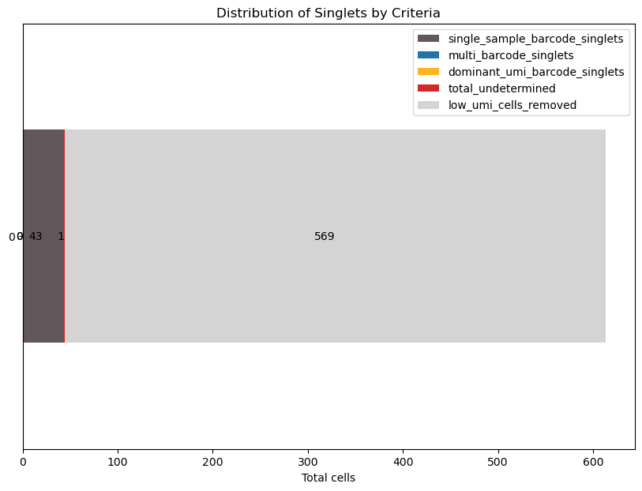

Vignette to use singletCode Command Line tool to analyse single-cell data with watermelon barcodes
==================================================================================================

The barcode region is assumed to be amplified using Illumina MiSeq.

All the data for this vignette and the files output from it can be
downloaded
`here <https://github.com/GoyalLab/SingletCodeWebsite/raw/main/source/dataVignette/watermelonVignetteData.zip>`__. It
contains inputFiles and the outputFiles (it contains a test folder which has the expected output files). This vignette can be downloaded as a jupyter notebook from the `singletCode Tools repo <https://github.com/GoyalLab/singletCodeTools/tree/main/vignette>`_.

First step is to understand the samples present in the FASTQ files.
~~~~~~~~~~~~~~~~~~~~~~~~~~~~~~~~~~~~~~~~~~~~~~~~~~~~~~~~~~~~~~~~~~~

The sample fastq files are in the inputFolder. We can identify the
sample name and number from the FASTQ file. For example,
sampleName_S1_L001_R1_001.fastq.gz means that the sample name is
sampleName and sample number is 1.Make sure that both read 1 and read 2
for each sample are present in the same folder (R1 and R2)

Creating sample sheet for these two samples. 
~~~~~~~~~~~~~~~~~~~~~~~~~~~~~~~~~~~~~~~~~~~~

Along with this, we will also install all the packages needed to run this notebook. 

.. code:: ipython3

    %conda install scipy tqdm matplotlib biopython python-levenshtein pandas
    import pandas as pd

.. code:: ipython3

    p = "path/to/downloaded/and/unzipped/data"

.. code:: ipython3

    sampleSheet = pd.read_csv(f"{p}/inputFiles/sampleSheet.csv")
    sampleSheet

.. raw:: html

    

    
    <table border="1" class="dataframe">
      <thead>
        <tr style="text-align: right;">
          <th></th>
          <th>sampleName</th>
          <th>sampleNumber</th>
        </tr>
      </thead>
      <tbody>
        <tr>
          <th>0</th>
          <td>sampleName</td>
          <td>1</td>
        </tr>
        <tr>
          <th>1</th>
          <td>otherSampleName</td>
          <td>2</td>
        </tr>
      </tbody>
    </table>
    

    

Installing singletCode Command line tool
~~~~~~~~~~~~~~~~~~~~~~~~~~~~~~~~~~~~~~~~

To use the singletCode command line tool, clone the repository from
GitHub. Let the Path to the folder you are running this command be
**Path**

.. code:: ipython3

    !git clone https://github.com/GoyalLab/singletCodeTools
    Path = "path/to/singletCodeTools/repo"

Now, to run the watermelon module of singletCodeTools, you need to run
this command. If we are going by the folder structure of the zipped file
and **p** is *path to the unzipped folder containing example files*,
then 1. **inputFolder** will be p/inputFiles/ 2. **outputFolder** will
be p/outputFiles/ 3. **sampleSheet** will be
p/inputFiles/sampleSheet.csv

.. code:: ipython3

    import subprocess
    
    command = [
        'python',
        f'{Path}/commandLine/singletCodeCommandLine.py',
        'watermelon',
        '-i',  f'{p}/inputFiles',
        '-o',  f'{p}/outputFiles',
        '-s', f'{p}/inputFiles/sampleSheet.csv',
        '--outputName', 'watermelonBarcodeUmi.csv'
    ]
    
    result = subprocess.run(command)

.. parsed-literal::

    Arguments received:
      command: watermelon
      inputFolder: /home/keerthana/Goyal_Lab/websiteToolData/thingsToAddToWebsite/watermelonVignetteData/inputFiles
      outputFolder: /home/keerthana/Goyal_Lab/websiteToolData/thingsToAddToWebsite/watermelonVignetteData/outputFiles
      sampleSheet: /home/keerthana/Goyal_Lab/websiteToolData/thingsToAddToWebsite/watermelonVignetteData/inputFiles/sampleSheet.csv
      outputName: watermelonBarcodeUmi_Check.csv
      use10X: False
      input10X: None
    All the inputs for the command are valid and will proceed with creating the barcode sheet for all the samples in the sheet.
    Filtered rows of dataframe: 940
    Filtered rows of dataframe: 718

**NOTE**

In the current FASTQ file, the pattern for the watermelon barcode is
GGGCTG(([AT][CG]|[CG][AT]){15})GACGCT.

If this is not true for the barcodes in your data, then you can go to
*processSampleBarcode* function in
*Path/commandLine/watermelonUtilityFunctions.py* and change the line
starting with **pattern =**.

Using 10X list of cell IDs to check that all the cell IDs were also captured in scRNAseq
~~~~~~~~~~~~~~~~~~~~~~~~~~~~~~~~~~~~~~~~~~~~~~~~~~~~~~~~~~~~~~~~~~~~~~~~~~~~~~~~~~~~~~~~

If you want to use a 10X single-cell RNA sequencing of the same set of
cells to check which barcoded cells are of interest to you, then you can
add –use10X flag to your command and provide the path to the list of
cell IDs.

.. code:: ipython3

    result = subprocess.run([
        'python',
        f'{Path}/commandLine/singletCodeCommandLine.py',
        'watermelon',
        '-i', f'{p}/inputFiles/',
        '-o', f'{p}/outputFiles/',
        '-s', f'{p}/inputFiles/sampleSheet.csv',
        '--outputName', 'watermelonBarcodeUmiWith10X.csv',
        '--use10X',
        '--input10X', f'{p}/inputFiles/barcodes.tsv'
    ], capture_output=True, text=True)
    
    # Check if the command was successful
    if result.returncode == 0:
        print("Command executed successfully")
        print("Output:\n", result.stdout)
    else:
        print("Command failed")
        print("Error:\n", result.stderr)

.. parsed-literal::

    Command executed successfully
    Output:
     Arguments received:
      command: watermelon
      inputFolder: /home/keerthana/Goyal_Lab/websiteToolData/thingsToAddToWebsite/watermelonVignetteData/inputFiles/
      outputFolder: /home/keerthana/Goyal_Lab/websiteToolData/thingsToAddToWebsite/watermelonVignetteData/outputFiles/
      sampleSheet: /home/keerthana/Goyal_Lab/websiteToolData/thingsToAddToWebsite/watermelonVignetteData/inputFiles/sampleSheet.csv
      outputName: watermelonBarcodeUmiWith10X_Check.csv
      use10X: True
      input10X: /home/keerthana/Goyal_Lab/websiteToolData/thingsToAddToWebsite/watermelonVignetteData/inputFiles/barcodes.tsv
    All the inputs for the command are valid and will proceed with creating the barcode sheet for all the samples in the sheet.
    Filtered rows of dataframe: 791
    Filtered rows of dataframe: 629
    

Run singletCode to identify true singlets using the cellID-Barcode-UMI file just created
~~~~~~~~~~~~~~~~~~~~~~~~~~~~~~~~~~~~~~~~~~~~~~~~~~~~~~~~~~~~~~~~~~~~~~~~~~~~~~~~~~~~~~~~

Using the count module available in the command line

.. code:: ipython3

    import subprocess
    
    result = subprocess.run([
        'python',
        f'{Path}/commandLine/singletCodeCommandLine.py',
        'count',
        '-i', f'{p}/outputFiles/watermelonBarcodeUmiWith10X.csv',
        '-o', f'{p}/outputFiles/watermelon'
    ], capture_output=True, text=True)
    
    # Check if the command was successful
    if result.returncode == 0:
        print("Command executed successfully")
        print("Output:\n", result.stdout)
    else:
        print("Command failed")
        print("Error:\n", result.stderr)

.. parsed-literal::

    Command executed successfully
    Output:
     Arguments received:
      command: count
      input_file: /home/keerthana/Goyal_Lab/websiteToolData/thingsToAddToWebsite/watermelonVignetteData/outputFiles/watermelonBarcodeUmiWith10X_Check.csv
      out_prefix: /home/keerthana/Goyal_Lab/websiteToolData/thingsToAddToWebsite/watermelonVignetteData/outputFiles/watermelon
      umi_cutoff_ratio: 7.5e-06
      umi_diff_threshold: 50
      dominant_threshold: 10
      min_umi_good_data_cutoff: 2
    INFO: Raw data counts
    sampleNum
    sampleName         693
    otherSampleName    524
    Name: count, dtype: int64
    INFO: Using raio based filtering.
    Current Sample Adjusted UMI cutoff: 2
    Total cells: 45
    Sample sampleName singlet: 43
    Total Singlets: 43
    Total Multiplets: 1
    All singlets identified are unique? True
    Total Singlets: 43
    Total Multiplets: 1
    INFO: Using raio based filtering.
    Current Sample Adjusted UMI cutoff: 2
    Total cells: 22
    Sample otherSampleName singlet: 22
    Total Singlets: 22
    Total Multiplets: 0
    All singlets identified are unique? True
    Total Singlets: 22
    Total Multiplets: 0
    All singlets identified are unique? True
    

There different files which are output from this command: 1. different
kinds of singlets in each of the samples: single_barcode, dominant_umi,
multi_barcode 2. a combined list of all singlets for a sample:
singlets_all 3. a csv file containing the statistics of each kind of
singlet, number of potential multiplets and cells filtered out due to
low UMI counts of barcodes 4. the list of potential multiplets for each
of the samples: multiplets

For more explanation on different kinds of singlets seen in the output
files, you can refer
`here <https://goyallab.github.io/SingletCodeWebsite/singletCode/>`__
and for example of data showing this, you can refer to the vignette
about singletCode package.

Visualising the output
~~~~~~~~~~~~~~~~~~~~~~

Visualising singletCode output by plotting the distribution of low UMI
cells, different kinds of singlets, and undetermined cells for sample
sampleName

.. code:: ipython3

    import matplotlib.pyplot as plt
    
    stats = pd.read_csv(f"{p}/outputFiles/watermelon_sampleName_singlets_stats.csv")
    colors = ['#62575b', '#2175a8', '#feb422', '#d62728', '#d4d4d4']  # Example colors, modify as needed
    plotData = stats.drop(columns = ['dataset', 'total_cells', "total_singlets"])
    
    # Plotting
    ax = plotData.plot(kind='barh', stacked=True, figsize=(10, 7), color=colors)
    
    for plot in ax.patches:
        ax.annotate(f'{int(plot.get_width())}', (plot.get_x() + plot.get_width()/2, plot.get_y() + plot.get_height()/2), ha='right', va='center')
    
    ax.set_xlabel('Total cells')
    ax.set_title('Distribution of Singlets by Criteria')
    plt.show()

In the above plot, you see that the original data had 569 cells that were removed due to low barcode UMI count, 43 singlets with a single-barcode associated with them and a single multiplet (singletCode could not determine if it was a singlet for sure.)

Looking at the scRNAseq data associated
---------------------------------------

Since this data has both scRNAseq and barcodes for the same cells, we
can analyse them together

Installing and importing scanpy package to do this

.. code:: ipython3

    #Install scanpy for further single-cell RNAseq analysis
    # %conda install -c conda-forge scanpy python-igraph leidenalg
    #Import scanpy
    import scanpy as sc

In case there are version conflicts during this installation or while importing scanpy, we found *%conda update --all* to be an useful command that fixed the version conflict previously.
Reading in the 10X h5ad object associated with the same watermelon data

.. code:: ipython3

    adata = sc.read_h5ad(f"{p}/inputFiles/watermelonScRnaSeqData.h5ad")
    adata

.. parsed-literal::

    AnnData object with n_obs × n_vars = 1093 × 27264

Read in the output files to identify cells as being singlets, multiplets or being removed for low barcode UMI threshold
~~~~~~~~~~~~~~~~~~~~~~~~~~~~~~~~~~~~~~~~~~~~~~~~~~~~~~~~~~~~~~~~~~~~~~~~~~~~~~~~~~~~~~~~~~~~~~~~~~~~~~~~~~~~~~~~~~~~~~~

First, reading in the cellID-barcode-UMI sheet generated earlier with
additional filter using scRNAseq data

.. code:: ipython3

    cellidBarcodeUMI = pd.read_csv(f'{p}/outputFiles/watermelonBarcodeUmiWith10X.csv')

Reading in all the singlets and multiplets idenified in the two samples.
There might not always be multiplets - check the stats file to see if
there are any. In this example, there are no multiplets in
otherSampleName.

.. code:: ipython3

    sampleNameSinglets = pd.read_csv(f"{p}/outputFiles/watermelon_sampleName_singlets_all.txt", header = None)
    otherSampleNameSinglets = pd.read_csv(f"{p}/outputFiles/watermelon_otherSampleName_singlets_all.txt", header = None)
    sampleNameMultiplets = pd.read_csv(f"{p}/outputFiles/watermelon_sampleName_multiplets.txt", header = None)

Identifying the cells that were below the barcode UMI threshold and were
filtered out by singletCode

.. code:: ipython3

    lowUmiCells = cellidBarcodeUMI[~(cellidBarcodeUMI['cellID'].isin(sampleNameSinglets[0]) | 
                                     cellidBarcodeUMI['cellID'].isin(otherSampleNameSinglets[0]) | 
                                     cellidBarcodeUMI['cellID'].isin(sampleNameMultiplets[0]))]
    

Annotating the cells in adata with these labels
~~~~~~~~~~~~~~~~~~~~~~~~~~~~~~~~~~~~~~~~~~~~~~~

.. code:: ipython3

    #Annotating the adata with these labels using the lists created
    adata.obs.loc[adata.obs.index.isin(sampleNameSinglets[0]), 'singletStatus'] = 'singlet'
    adata.obs.loc[adata.obs.index.isin(otherSampleNameSinglets[0]), 'singletStatus'] = 'singlet'
    adata.obs.loc[adata.obs.index.isin(sampleNameMultiplets[0]), 'singletStatus'] = 'multiplet'
    adata.obs.loc[adata.obs.index.isin(lowUmiCells['cellID']), 'singletStatus'] = 'low UMI'

**Note** that in this vignette we are not doing any actual QC - but in
actual analysis, it would need to be done.

.. code:: ipython3

    
    sc.pp.calculate_qc_metrics(adata, inplace=True)

Calculating PCA and UMAP for visualization
~~~~~~~~~~~~~~~~~~~~~~~~~~~~~~~~~~~~~~~~~~

.. code:: ipython3

    #Calculating PCA for the data and plotting variance ratio
    sc.tl.pca(adata)
    sc.pl.pca_variance_ratio(adata, n_pcs=20)

.. code:: ipython3

    sc.pl.pca(
        adata,
        color = ['n_genes_by_counts', 'total_counts', 'singletStatus'],
        size = 100,
    )

.. image:: watermelonDatasetVignette_files/watermelonDatasetVignette_39_0.png

.. code:: ipython3

    #Calculating neighbours and UMAP from that for further visualization
    sc.pp.neighbors(adata)
    sc.tl.umap(adata)

.. parsed-literal::

    /home/keerthana/miniconda3/envs/singletCodePackage/lib/python3.9/site-packages/tqdm/auto.py:21: TqdmWarning: IProgress not found. Please update jupyter and ipywidgets. See https://ipywidgets.readthedocs.io/en/stable/user_install.html
      from .autonotebook import tqdm as notebook_tqdm

.. code:: ipython3

    sc.pl.umap(
        adata,
        color=['singletStatus'],
        size=60,
    )

Saving the final adata
~~~~~~~~~~~~~~~~~~~~~~

.. code:: ipython3

    adata.write(f"{p}/outputFiles/watermelonScRNA_check.h5ad")
